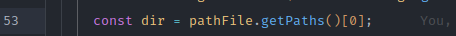

# Zip File

A decisão de criar esse programa foi para exercer conhecimento no curso [java-curso-completo](https://www.udemy.com/course/java-curso-completo/learn/lecture/10852516#content), onde aprendi conceitos básicos e avançados de POO.
> O programa é um serviço para zipar arquivos e deletar os aqruivos que já foram zipados.
> A inteção do programa é prevenir grande quantidades de arquivos "lixos".

E meio a decisão de fazer este programa tive que aprender como a manipular arquivos, pastas, sistema operacional e zipar no nodejs.
____
### Referências:
* [W3 schools - Nodejs File System](https://www.w3schools.com/nodejs/nodejs_filesystem.asp)
* [W3 schools - Nodejs Path](https://www.w3schools.com/nodejs/nodejs_path.asp)
* [W3 schools - Nodejs OS](https://www.w3schools.com/nodejs/nodejs_os.asp)
* [W3 schools - Nodejs Streams](https://www.w3schools.com/nodejs/nodejs_streams.asp)
* [Archiver](https://www.archiverjs.com/docs/quickstart/)

### Pré-requisitos:
* Node: v22.18.0
* Npm: 10.9.3
___
### Instruções:
```bash
# Clone este repositório
$ git  clone <https://github.com/Solrac23/zip-files.git>

# Acesse a pasta do projeto no terminal/cmd
$ cd zip-files

# Vá para a pasta src
$ cd src

# Instale as dependências
$ npm install

# Execute a aplicação

$ npm start
```

Para executar o programa na pasta certa terá que no aruivo principal `app.ts`, adicionar a pasta que deseja zipar os arquivos.


O `osHomedir` executa a partir da basta raiz do usuário, ou seja, `C:\\User\<seu usuario>` ou `/home/<seu usuario>`.

E nesta linha do código , o programa pega a pasta que vai executar o serviço.

⚠️**Obs**: Após a finalização do curso este código passaram por uma refatoração.⚠️
___
### 🛠 Tecnologias

As seguintes ferramentas foram usadas na construção do projeto:

- [Node.js](https://nodejs.org/en/)
- [TypeScript](https://www.typescriptlang.org/)

## Autor:
* [Carlos Eduardo](https://github.com/Solrac23)